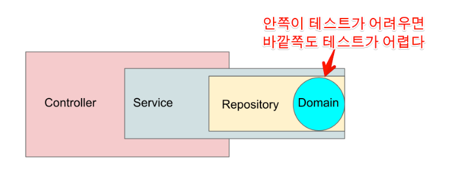
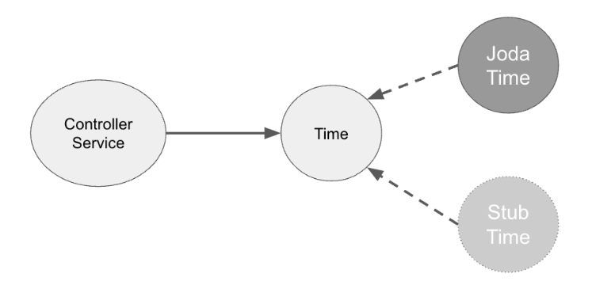

# Http
## IntelliJ
### [IntelliJ Http Client document](https://www.jetbrains.com/help/idea/http-client-in-product-code-editor.html)

- http client 관련 intellij 문서
- 다음에 사용할 때 한번 정독하고 사용해봐야겠다.
 

### [인텔리제이 .http로 postman 대체하는 방법 - 미니 블로그 : 메모하는 습관](https://otrodevym.tistory.com/entry/intellij-%EC%9D%B8%ED%85%94%EB%A6%AC%EC%A0%9C%EC%9D%B4-http%EB%A1%9C-postman-%EB%8C%80%EC%B2%B4%ED%95%98%EB%8A%94-%EB%B0%A9%EB%B2%95)
- .http 에서 알아야할 필수적인 부분 몇가지를 정리해 놓은 글
- 빠르게 적용할 일이 있을 때 참고해서 사용하자.

# 방법론

### [[남글읽기] @SpyBean @MockBean 의도적으로 사용하지 않기 - 기억보단 기록을]](https://velog.io/@jomminii/read-blogs-4) 

[@SpyBean @MockBean 의도적으로 사용하지 않기 - 기억보단 기록을](https://jojoldu.tistory.com/320)

언젠가부터 테스트를 작성할 때 `@Mock`과 `@InjectMock` 을 쓰는게 당연하다고 생각을 하고 있었다. 원하는 테스트 결과를 설계하기 위해 불필요한 테스트 구현을 줄여주고 테스트 자체도 손쉽게 해주기 때문이다.

그런데 이 편함 때문에 놓치는게 있을 수 있다고 한다.

설계에 있어서의 코드 스멜을 테스트의 간편함으로 인해 놓칠 수 있다고 한다.

다른 의존성들을 무시하고 필요한 의존성만 mock 으로 처리하기 때문에 불필요한 의존성들이 설정되어 있어도 알아챌 수 없게 된다는 이야기인데,

요즘 테스트에 관련된 글을 많이 읽어보면서 TDD 를 제대로 공부해봐야겠다는 생각이 많이 들고 있다.

아직 읽을 책들이 많은데...TDD 책은 언제 읽지...

일단 이 글을 읽고 무지성으로 쓰고 있던 모킹에 대해서 쓰기 전에 한 번 더 생각할 수 있게 되었다.

이렇게 생각의 폭이 점점 넓어지는중.

### [테스트하기 좋은 코드 - 제어할 수 없는 코드 개선 - 기억보단 기록을](https://jojoldu.tistory.com/676)
`LocalDateTimw.now()` 와 같이 실행 시점마다 값이 달라지는 값에 의존하는 테스트는 테스트하기 좋지 않은 코드, 제어할 수 없는 코드다.
테스트 하기 어려운 로직이 도메인 로직에 들어있을 경우, 도메인에 의존한 전반적인 계층에 대한 테스트가 모두 어려워질 수 있다.
즉 테스트의 어려움은 전파된다.

#### 해결방법 1
- 생성자, 함수(메소드)의 인자로 테스트하기 어려운 코드의 결과를 받는다.
  - 함수의 인자가 너무 많아진다고 생각이 들 수 있음
    - 이때는 DTO 로 묶어서  전달하거나, 생성자 주입을 받아서 사용하거나, 함수 인자의 기본값을 사용하면 됨
    - (기본값 괜찮네, 테스트 할때는 직접 사용하고 싶은 값 넣어서 사용하면 됨)
    - 그런데 자바는 python 이나 javascript 처럼 default parameter 를 지원하지 않네
    - [Does Java Have default parameters? - dev in web](http://dolszewski.com/java/java-default-parameters/) 을 참고해보면 method overloading, null 활용, 빌터 패턴 사용 등을 보여주는데
    - 빌터 패턴이 제일 바람직해 보임
  - 만약 위에서의 방법을 안쓴다면, 일단 제어할 수 없는 코드의 위치를 가장 바깥 쪽으로 밀어내는 방법도 있음.
    - repository 에서 service 로 service 에서 controller 로 해당 코드의 결과 값을 전달하는 곳을 밖으로 빼면
    - 그 안의 로직은 안전할 수 있음
    - 하지만 이 또한 controller 와 같은 바깥 로직은 테스트 하기가 어려워지므로 피하는게 좋음

#### 해결방법 2
- 의존성 주입을 사용한다.
- 
  - 인터페이스 구현체를 만들어서 하나는 메인코드에, 다른 하나는 테스트 코드에 사용
  - 테스트에서 사용할 구현체에는 명확한 데이터를 전달하면 되므로 테스트 하기 어려운 코드를 테스트 할 수 있게 만들어준다.

#### 결론
- 디폴트 파라미터 사용과 의존성 주입을 사용하면 된다!

### [테스트하기 좋은 코드 - 테스트하기 어려운 코드 - 기억보단 기록을](https://jojoldu.tistory.com/674)
- 테스트를 위해 구현 설계가 변경될 수 있다. 테스트 코드는 구현의 보조적인 수단이 아니며 같은 레벨로 봐야한다.
- 좋은 디자인으로 구현된 코드는 대부분 테스트 하기가 쉽다.
- 테스트는 구현의 보조 수단이 절대 아니며 오히려 구현 설계 smell 을 맡게 해주는 좋은 수단이다.

> 테스트 하기 좋은 코드
> - 몇 번을 수행해도 항상 같은 결과가 반환되는 함수 (멱등성이 보장되는 순수 함수)

> 테스트 하기 어려운 코드
> - 제어할 수 없는 값에 의존하는 경우
>   - Random(), new Date() 등 실행할때마다 결과가 다른 함수에 의존하는 경우
>   - readLine 등 사용자들의 입력에 의존하는 경우
>   - 전역함수, 전역 변수 등에 의존하는 경우
>   - 외부 SDK 에 의존하는 경우
> - 외부에 영향에 영향을 주는(받는) 코드
>   - console.log 같은 표준 출력
>   - Logger 등의 사용
>   - 메시지 큐 등 외부로의 메시지 발송
>   - 데이터베이스 등에 의존
>   - 외부 API 에 의존

같이 보면 좋을 글

> [정진욱님 - Testing, Oh my!](https://jwchung.github.io/testing-oh-my)
> 
> [권용근님 - 무엇을 테스트할 것인가](https://www.youtube.com/watch?v=YdtknE_yPk4)

 

### [테스트 코드와 반증가능성에 대한 메모 - 기계인간 John Grip](https://johngrib.github.io/wiki/article/test-code-and-falsifiability/)

테스트라는게 모든 케이스를 완벽하게 모두 작성하면 좋겠지만 리소스에는 한계가 있기에 우선순위를 고려해서 작성해야하는 경우가 많다. 이런 경우에 어떤 테스트를 더 우선순위에 두고 작성해야하는지 생각해볼 수 있게 해주는 글이었다.

칼 포퍼의 반증가능성이라는 이론을 가져와서 설명하고 계신데,
- 입증은 위험한 예측들의 결과일때만 가치가 있다.
- 그 이론을 반박할 수 있는 사건을 예상할 수 있는 경우에만 입증으로써의 가치
- 어떤 사건에 의해서도 논박될 수 없는 이론은 비과학적

이런 정도의 내용을 담고 있다.

요약해보자면 어떠한 이론이 맞는지 검증하기 위해서는 이 이론을 깨지게 할 수 있는 사건들을 예측하고, 이에 대한 입증이 성공해야만 이론 검증에도 성공한다는 말을 하고 있는 것 같다.

예전에 어디서 봤던 “어떤 명제에 대해 하나라도 거짓인 케이스가 있다면 그건 거짓” 이라고 했던 것과 좀 비슷한 맥락이라고 생각한다.

이 반증가능성을 기반으로 기계인간님이 매긴 테스트 우선순위는 아래와 같다.

* 어떤 상황에서도 무조건 통과하는 테스트 코드는 바람직하지 않다. 그건 좋은 테스트 같지만 사실은 나쁜 테스트다.
* 코드가 잘 동작하는 지 입증하는 테스트 코드를 작성하는 것은 상대적으로 쉬우며 약간 가치있다.
* 코드가 이상하게 동작하는 것을 검사하는 코드는 가치있다.
* 버그를 검사하는 테스트 코드가 가장 가치있다.
    * 특히 버그가 되살아 났을 때 실패하는 테스트.
    * 이런 테스트는 절대로 삭제하면 안된다

지금까지 테스트를 작성하면서 무조건 통과하는 테스트 코드는 작성하지 않으려고 노력 했었고,
다른 테스트도 작성하긴 했었는데 우선순위에 대해서는 많은 생각을 하진 않았었다.

일단 코드가 잘 동작하는 지 입증하는 테스트 부터 작성하고 그 이후에 이상하게 동작하는, 버그 테스트 코드들을 작성했던거 같은데
잘 동작하는 지 입증하는 테스트가 생각하기 더 쉬워서 그랬던 것 같다.

앞으로는 좀 더 우선순위를 생각해보고 중요한 테스트를 먼저 작성하는 습관을 가져야겠다.